|  **Version**  |  **Date**  |  **Edited By**  |  **Comments**  | 
|  --- |  --- |  --- |  --- | 
| v1 | 04/09/2022 | Edson | TBC:
1. Confirm with backend on how Firebase is modeled together with our server

1. Client server relationship

1. Linters and code formatters

1. Hosting platform

 | 
| v2 | 05/09/2022 | Henrique | Added:<ul><li>firebase server side relationship model

</li><li>Client server relationship

</li><li>Linters and code formatters

</li><li>Hosting platforms

</li></ul> | 
| v3 | 27/09/2022 | Edson | Added:<ul><li>4+1 Model overview and diagram

</li><li>Logical view and scenarios (Domain class diagram and use case diagram)

</li></ul> | 
| v3.1 | 28/09/22 | Keigo | Added:<ul><li>Database Models (Geordan)

</li><li>System Sequence Diagrams for User Stories

</li><li>General formatting of page

</li></ul> | 

 **An overview model** Excalidraw Link: [https://excalidraw.com/#room=88ecfda8311201d6f98e,Qa_Rch_vv3cxWuKldtEA7A](https://excalidraw.com/#room=88ecfda8311201d6f98e,Qa_Rch_vv3cxWuKldtEA7A)

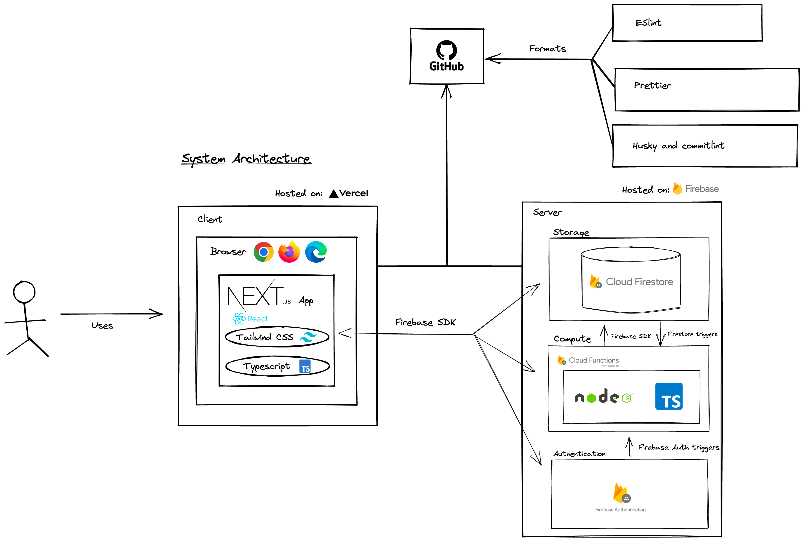

 **4+1 Architectural View Model** 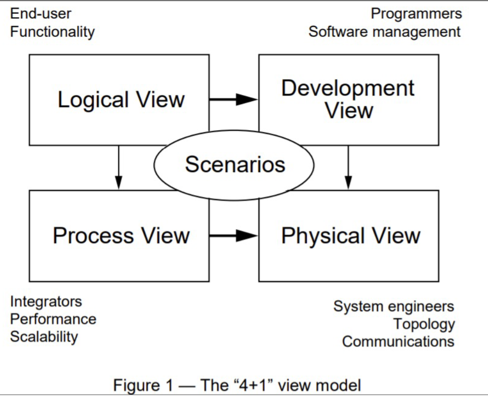
## 4 Views:
Logical view

 _What_ : Describes the functional requirements - what the system should provide in terms of services to its users.

 _Shown in_ :Domain class diagram ([https://excalidraw.com/#room=7d7068e19f0340566773,rLlSuS1KkiU9Vq9po0JjoA](https://excalidraw.com/#room=7d7068e19f0340566773,rLlSuS1KkiU9Vq9po0JjoA))

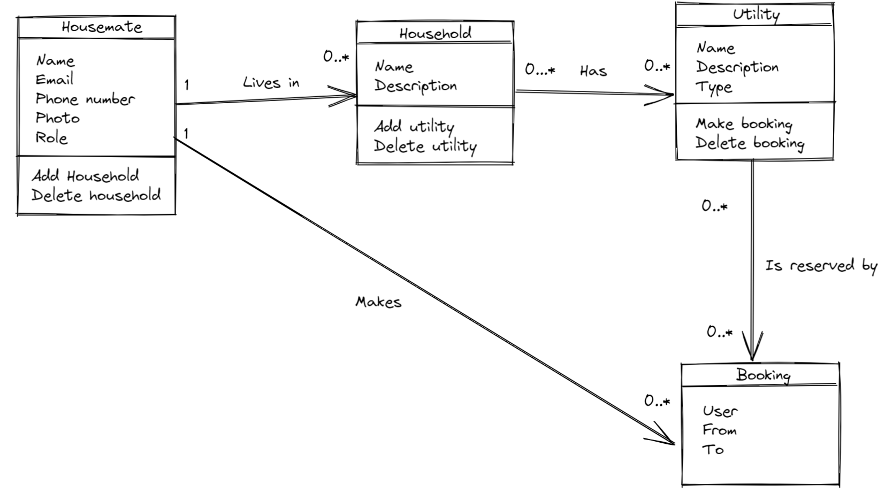Process view _What_ : Explains the system processes and how they communicate (eg. Interaction between front-end and back-end).

### System Sequence Diagram (SSD)
Below are system sequence diagrams to visualize the flow of functionality for our user stories and how the application will talk to the back-end (Firebase) to read and write data.

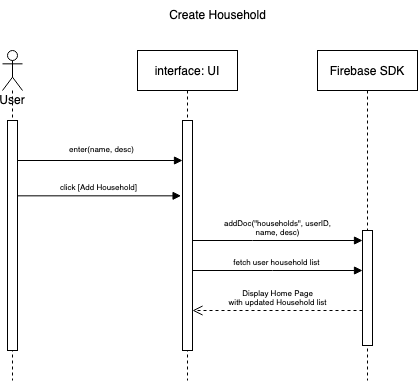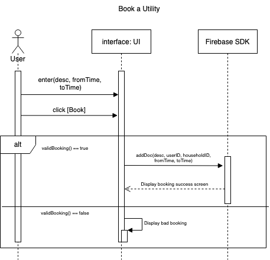

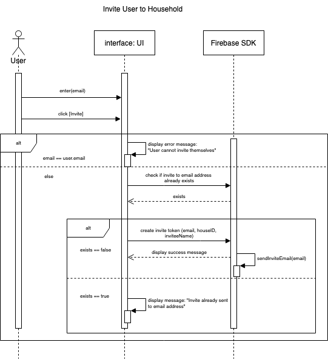Development view _What_ : Illustrates the system from a programmer’s perspective, and is concerned with software management (eg. Packages used, execution)

 _Why:_ We chose this over a component diagram as this was more applicable to our project, given that we’re storing user data within models. Queries are made through fields and nesting collections of data. The firebase database (Firestore) is a flexible database system, where we can apply SQL and NoSQL practices to best read and write data for our application.

### Database Model

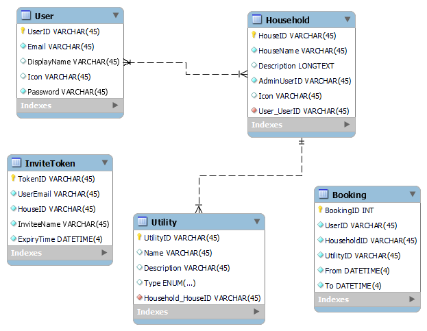

Physical View (aka deployment view) _What_ : Depicts the system from the a system engineer’s point of view. Describes the mapping of software onto hardware (eg. Deployment, hardware specifications)

 _Shown in_ : Deployment diagram

We don’t have a diagram for deployment, as our builds are automatically hosted on [[Vercel|CI-CD-Pipeline]]. Vercel handles the continuous deployment for our application, therefore we deemed the deployment model unnecessary for our project.

Scenarios _What_ : Use-case view. Illustrated with cases to describe sequences of interactions between objects and between processes.

 _Shown in_ : Use-case diagram ([https://excalidraw.com/#room=5dec4ba2cd1d64b29aa1,TpWAMqseleOP3_4_0Uyp2w](https://excalidraw.com/#room=5dec4ba2cd1d64b29aa1,TpWAMqseleOP3_4_0Uyp2w))

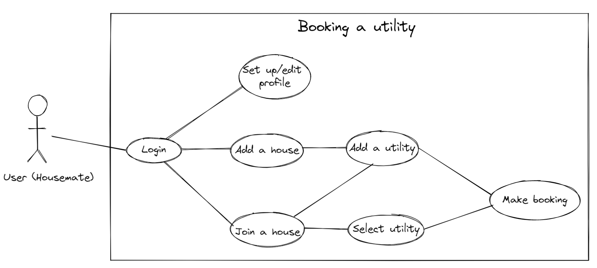 **Resources** [https://canvas.lms.unimelb.edu.au/courses/126818/pages/lecture-5-22-slash-8-slash-22?module_item_id=4044825](https://canvas.lms.unimelb.edu.au/courses/126818/pages/lecture-5-22-slash-8-slash-22?module_item_id=4044825)

* 4+1 Architectural View Model 

* 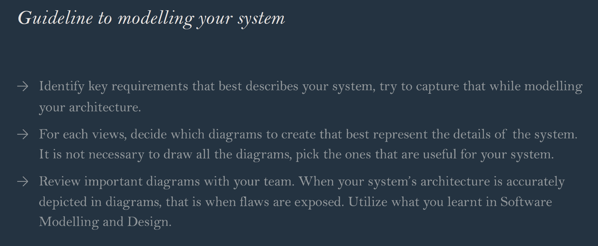
* System sequence diagram

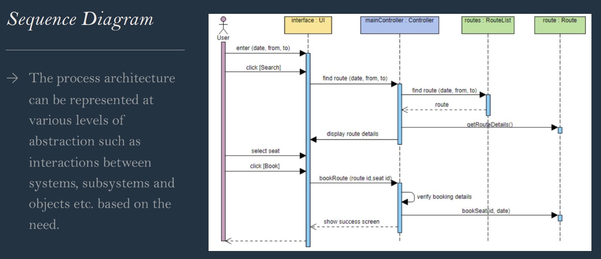
* Component diagram

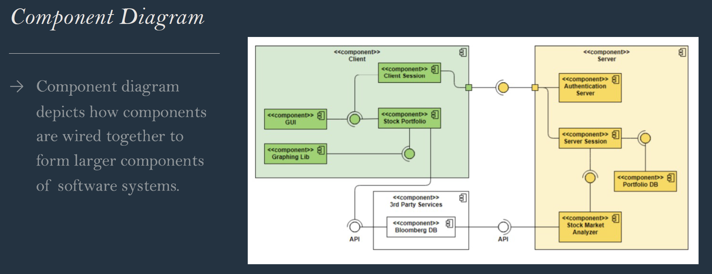
* Database model

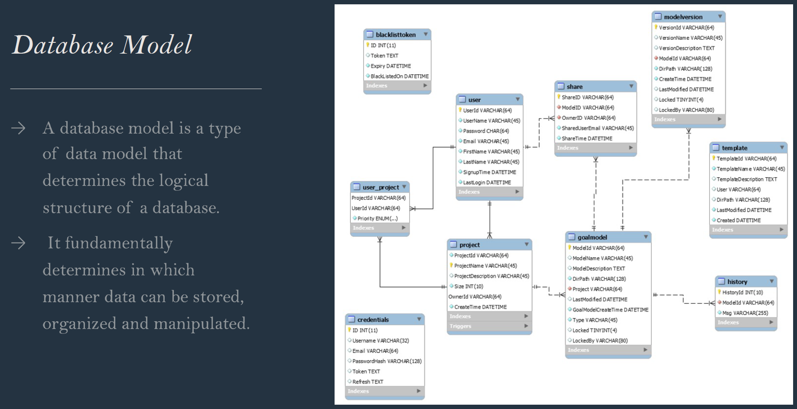
* Deployment diagram

*****

[[category.storage-team]] 
[[category.confluence]] 
