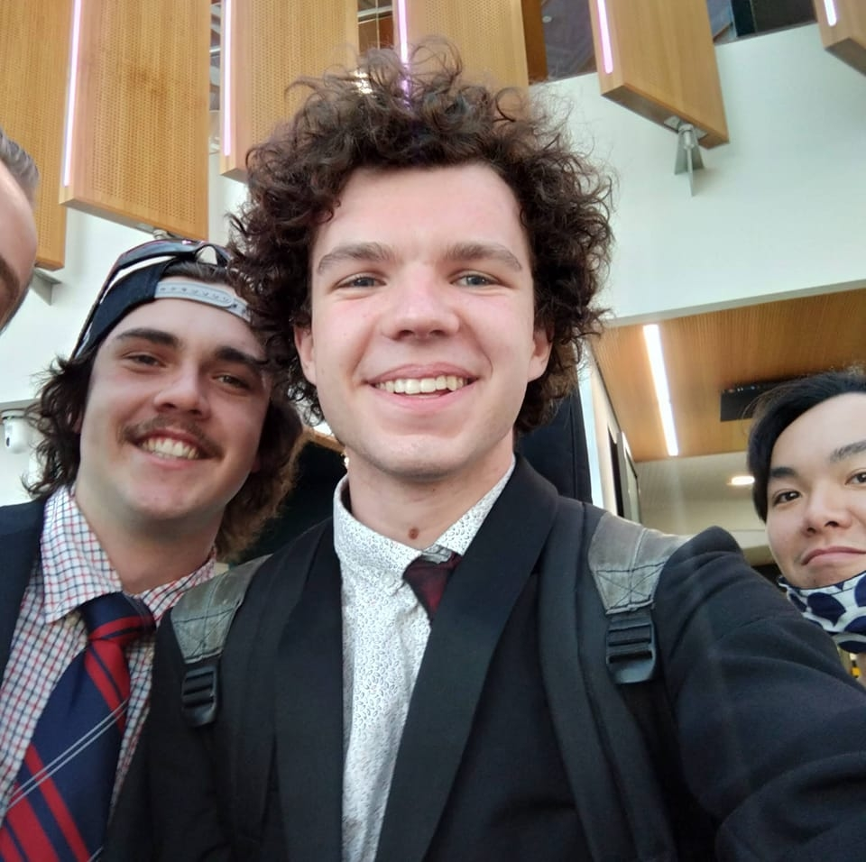
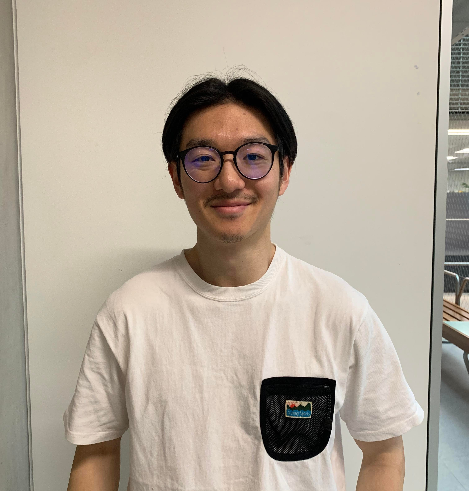

# Project Overview 

### To design a CRUD web-app…

*  **Working app name:** UTime (Utility Time)

*  **Target user:**  Share-house members, people who live in a house with multiple people and are forced to share various utilities

*  **Aim:**  Many people around the world are forced to share a home with people who have different schedules and expectations on when to use certain utilities around the house. The purpose of our web app is to make life easier for these people. We aim to create a way in which house members can better organise their utility/amenity schedule, allowing users to book time-slots for different rooms or appliances around the house so that members can plan ahead and avoid unnecessary conflicts.

To be more specific, in this project we will be designing and deploying a CRUD web application using React, Next.js, and Firebase. This project spans semester 2 (July - November). It is to be done in Agile fashion using the Scrum framework, divided into multiple sprints. You can see the policies that we will follow at ([Rules, Standards and Conventions](https://moistblast.atlassian.net/wiki/spaces/DOCS/pages/5111811/Rules+Standards+and+Conventions)). We will be working closely with our client Shizhan as to meet his expectations and requirements for the project. As of now our priorities lie with the essential features, in order to have a working prototype. See below for further details on our team, roles and road-map.

# The Team 

|  **Photo**  |  **Role**  |  **Name**  |  **Email**  |  **Bio**  | 
|  --- |  --- |  --- |  --- |  --- | 
|  | Client | Shizhan | [shizhanx@student.unimelb.edu.au](mailto:shizhanx@student.unimelb.edu.au) | A crazy anime lover who wore an anime girl T-shirt at his Bachelor's graduation ceremony.  | 
|  | Tutor | Wei Hong | [lai.w@unimelb.edu.au](mailto:lai.w@unimelb.edu.au) | This is a bio lol :). | 

| 
## Edson
 | 
## Geordan
 | 
## Henrique
 | 
## Keigo
 | 
## Luca
 | 
|  --- |  --- |  --- |  --- |  --- | 
|  |  |  |  |  | 
|  _Product Owner_  |  _Design Lead_  |  _Back-end lead_  |  _Front-end lead_  |  _Scrum Master_  | 
|  _yangyueedson@student.unimelb.eu.au_  |  _gbbennie@student.unimelb.edu.au_  |  _hdosreispure@student.unimelb.edu.au_  |  _nagaik@student.unimelb.edu.au_  |  _ligonzalez@student.unimelb.edu.au_  | 

# Roles 

|  **Role**  |  **Responsibilities**  | 
|  --- |  --- | 
|  _Product Owner_  | <ul><li>Primary point of contact between the team and the client in terms of product requirements for the development team.

</li><li>Organise meetings

</li><li>Keep track of meeting minutes

</li></ul> | 
|  _Design Lead_  | <ul><li>Responsible for all things design

</li><li>Optimize UI & UX through design

</li><li>Communicate design with front-end lead

</li></ul> | 
|  _Back-end Lead_  | <ul><li>Responsible for server/server-side applications and website architecture

</li><li>Data storage and functionality

</li><li>Security

</li></ul> | 
|  _Front-end Lead_  | <ul><li>Responsible for functionality of visual components

</li><li>Developing and maintaining the user interface

</li><li>Managing software workflow and frontend architecture

</li></ul> | 
|  _Scrum Master_  | <ul><li>Sprint planning, Sprint review, and Sprint retrospectives

</li><li>Ensure the development of user stories and scrum framework is followed

</li><li>Work to unblock developers to continue meeting objectives.

</li></ul> | 

# Road Map 

|  **Sprint 0 (Requirements & Design)**  | Mon, 8th August | 
|  --- |  --- | 
| <ul><li> _Included project set-up, design, requirements, initial documentation_ 

</li></ul> | 
|  **Sprint 1 (Progress & Code)**  | Mon, 29th August | 
| <ul><li> _Finalise design/requirements, first coding sprint_ 

</li></ul> | 

# Application link
[shitimes.vercel.app](http://shitimes.vercel.app/)

# Useful links

|  **Link**  |  **Description**  | 
|  --- |  --- | 
| [Github](https://github.com/IkePureza/shitimes/tree/main/app) | Repository for the project, please email  for access. Visit [Git/GitHub - docs](https://moistblast.atlassian.net/wiki/spaces/DOCS/pages/4882452/Git+GitHub) for more information on our repository. | 
| [Excalidraw](https://excalidraw.com/#room=7a6788147fb877f5620c,hEYhkeSIK0RJnQRw8_fZRg) | Low-fidelity prototype for our design | 
| [Zoom meetings](https://unimelb.zoom.us/j/6736158489?pwd=MWYxVjd5Ykc2cjluM1lWblZDNHNkUT09) | Permanent zoom link for reocurring meetings Password: 047128 | 

*****

[[category.storage-team]] 
[[category.confluence]] 
