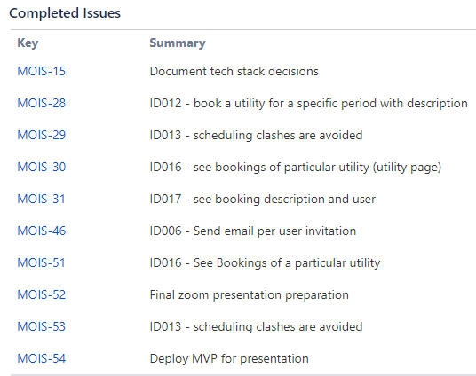
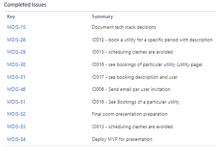

 _This page details scrum and sprint information regarding agile ceremonies_ 

For more detail on specific user stories  _see_ [[User stories|User-stories]] and for information on testing requirements of mentioned stories _see_ [[Acceptance criteria|Acceptance-criteria]]

|  **Sprint Number**  |  **Name**  |  **Overview**  | 
|  --- |  --- |  --- | 
| 1 |  _Planning_  | Brainstorming ideas, setting-up project, roles and planning | 
| 2 |  _Design & Requirements_  | Focus on design | 
| 3 |  _Submission & Code_  | Finalise deliverables for Progress Report | 
| 4 |  _Must-Haves_  | Complete user-stories regarding must-have moscow priority | 
| 5 |  _Presentation_  | Work on presentation requirements/slides | 
| 6 |  _Wrap-up Progress_  | Finalise requirements for Wk12 Progress Report | 
| 7 |  _Client Handover & Final Product_  | Finalise everything before client handover | 

### Scrum Ceremonies
Scrum ceremonies refer to a set of meetings that are used to manage the development of a project.

*  _Sprint retrospective_ 

*  _Sprint planning_ 

*  _Sprint review_ 

*  _Daily scrum_ 

Sprint 2: Design & Requirements **Start date** : 07/Aug/22

 **End date:**  30/Aug/22

 **Overview:**  Complete design side of the application and focus on Assignment1 requirements

 **Sprint Planning:** 

* Basic sprint planning - brief discussion in weekly meeting where the goals of the team were discussed in relation to the upcoming deadline.

* Backlog is formed regarding design features and assignment requirements

* Little estimation of effort for this sprint

* Conclusions - focus on design and proof of concept for client review

 **Tasks:** 

 _MOIS-6 * Finalise Tech Stack_  _MOIS-8 * Motivational model v1_  _MOIS-9 * User story v1_  _MOIS-10 * Brainstorming requirements_  _MOIS-11 * Who-do-be-feel lists for motivational model_  _MOIS-12 * Low fidelity prototype v2_  _MOIS-13 * Organise client meeting no.2_  _MOIS-14 * Proof of Concept_  **Sprint Retrospective:** 

|  **Going Well**  | 
|  --- | 
| <ul><li>Finished everything on time

</li></ul> | 
| <ul><li>Role assignment worked well

</li></ul> | 
|  **To Improve**  | Details | 
| Task Allocation | <ul><li>More tasks could be allocated to maximise efficiency

</li></ul> | 

 **Sprint Review** 

* No official sprint review for this sprint

Sprint 3: Submission & Code **Start date** : 30/Aug/22

 **End date:**  17/Sep/22

 **Overview:**  Finalise our deliverables for WK6 Progress Report and continue/start coding our essential user stories to get a working model for our client to review

 **Sprint Planning:** 

* Planning during week 6 (29/08) team meeting - for essential functionality and refined UI

* Backlog is formed regarding remaining documentation, assignment requirements and design. Also included essential user stories for coding to obtain an MVP for future client review

* Estimation of effort for each task listed below, see Jira for more details

* Conclusions - focus on upcoming submission requirements and clear documentation (highest priority), user stories are lower.

 **Tasks:** 

 **Sprint Retrospective:** 

* Previous Retrospective Issues

    * More tasks could be allocated to maximise efficiency

    

|  **Going Well**  | 
|  --- | 
| <ul><li>High priority tasks were completed to a high standard and on time

</li></ul> | 
| <ul><li>Good estimation of effort for high priority tasks

</li></ul> | 
| <ul><li>Delegation of tasks

</li></ul> | 
|  **To Improve**  | Details | 
| Priority Tasks | <ul><li>Low priority tasks were not completed by the end of the sprint

</li></ul> | 
| Estimation of effort | <ul><li>Estimation of effort for user stories was inaccurate

</li></ul> | 

 **Sprint Review** 

* Because majority of coding user stories were incomplete and not fully implemented by the end of the sprint, an  **informal**  review of progress with the client was conducted

* We presented the work completed up until the end of this sprint to our client in order to gain feedback. This was held during  _Client Meeting 3_ . This involved presenting our working product and also feedback on CI/CD pipeline. 

* App is working towards MVP, but decent progress so far.

* More detail in [[Client meetings|Client-meetings]]

Sprint 4: Must-Haves **Start date** : 17/Sep/22

 **End date:**  28/Sep/22

 **Overview:**  Finish off working model for client review and ready submission 2 Wk9 progress report

 **Sprint Planning:** 

* Discussed in weekly meeting relating to previously unfinished user-stories and requirements from previous sprint, aswell as upcoming submission requirements

* Backlog is formed including unfinished user stories and new requirements such as testing, CI/CD and Scrum documentation

* Conclusions - Continue working on must-have stories

 **Tasks:** 

 **Sprint Retro:** 

* Previous Retrospective Issues

    * Estimation of effort and priority was ignored

    

|  **Going Well**  | 
|  --- | 
| <ul><li>Good collaboration

</li></ul> | 
| <ul><li>Good estimation of effort for high priority tasks

</li></ul> | 
| <ul><li>Task completion

</li></ul> | 
|  **To Improve**  | Details | 
| Review turn-around | <ul><li>Review turn-around could improve in order for user-stories to be marked as complete, front end and back end lead to follow through

</li></ul> | 
| Testing | <ul><li>Ran into issues with cypress, backend lead to follow through

</li></ul> | 
| Priority tracking | <ul><li>Priority tracking of tasks has been ignored, all members are up to date so not much of an issue

</li></ul> | 

 **Sprint Review** 

* Sprint Review conducted in weekly team meeting

* Most successful sprint yet

* Many user stories were completed to the point of review, but not yet merged.

* Merging to be completed for Sprint  _Presentation_ 

* Enough features completed for working MVP. New features to be put on pause until sprint no.6 

Sprint 5: Presentation **Start date** : 08/Oct/22

 **End date:**  17/Oct/22

 **Overview:**  Work on presentation requirements for upcoming group showcase

 **Sprint Planning:** 

* Feature freeze

* Work on finishing remaining functionality

* Slides for presentation

* Functionality for live demo

* Deploy

* Consider handover

 **Sprint Retro:** 

* Previous Retrospective Issues

    * Review turn-around

    * Testing issues

    

|  **Going Well**  | 
|  --- | 
| <ul><li>The presentation was a success

</li></ul> | 
| <ul><li>Stuck to time limit of 20 minutes

</li></ul> | 
| <ul><li>Managed to rehearse in order to cut out irrelevant points before presentation

</li></ul> | 
| <ul><li>Merged remaining functionality successfully

</li></ul> | 
| <ul><li>Testing fixed

</li></ul> | 
|  **To Improve**  | Details | 
|  | <ul><li>Not much to improve here, was a short effective sprint

</li></ul> | 

 **Sprint Review** 

* Sprint Review conducted after presentation

* Successful short sprint. Now time to finalise remaining features for client handover

* First on agenda is upcoming Progress submission

Sprint 6: Wrap-up Progress **Start date** : 17/Oct/22

 **End date:**  22/Oct/22

 **Overview:**  Finalise requirements for Wk12 Progress Report

* Sprint Planning, Review and Retrospective unofficially documented

 **Tasks** 

Sprint 7: Client Handover & Report (FINAL) **Start date** : 22/Oct/22

 **End date:**  10/Nov/22

 **Overview:**  Finalise everything before client handover. Complete report. Finish remaining features and merge/review pull requests.

 **Sprint Planning:** 

* Add edit and delete features. 

* Finalise nit-picks, 

* Finalise design (UI-UX)

* Bug squashing

* Refactoring before client handover

* Merge all features

* Professional Communications Report

*****

[[category.storage-team]] 
[[category.confluence]] 
