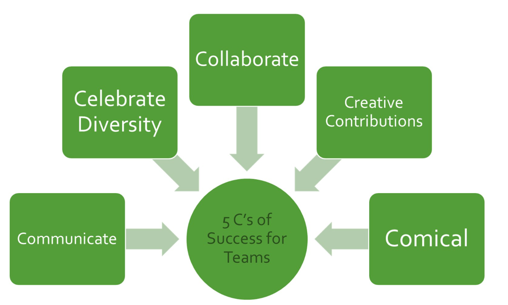

 _This page details how our team handles expectations, progress and cooperation_ 

## Ground Rules for Meetings & Team Expectations

*  **Be present**  - we cannot meet everyday so it is important to not only show-up, but to be present (not distracted) when we conduct a formal or informal meeting. This ensures our meetings are efficient and meaningful every time. 

*  **Team thinking**  - when stating an opinion, speak in hypotheses rather than certainties. Remember that ideas can be both good and bad, there is always middle ground. Try thinking as a team when it comes to big decisions.

*  **Ask questions**  - it is important that we are all adequately informed in all aspects of the project to maximise our learning. Remember to ask your teammates for help if you are unsure or unclear about anything, this will avoid having to meet again unnecessarily. 

*  **Accountability**  - Be accountable for action items in your court, we all have a job and it is best to take accountability rather than place blame and promote conflict.

*  **Be flexible**  - try be flexible about task assignments and always be willing to lend a helping hand to your team mates

*  **Split decisions** - in the event of a conflict or inability to decide on something as a team, the decision is to be delegated to the relevant team member. For example, the Design-Lead will have the last say on design-related issues, and the Product-Owner on dealings of the client.  

*  **Progress Checks** - At the start of a meeting, each member will detail their progress and bring forward any independent decisions made during the week. It is important to mention any of these smaller decisions so that possible conflicts can be avoided early and the team is aware of everything that's happening. 

*  **Misconduct**  - unprofessional or anti-social behaviour is frowned upon. Remember you are graded on your contribution and collaboration.

### Five C’s of Successful Teams

*****

[[category.storage-team]] 
[[category.confluence]] 
