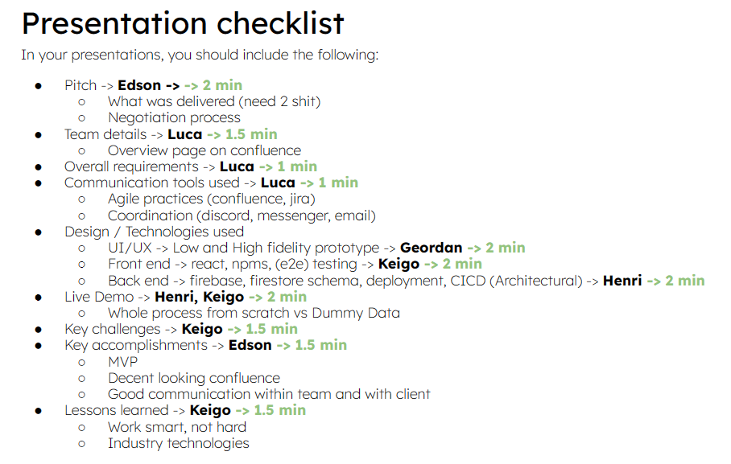

|  **Date**  |  **Notes**  | 
|  --- |  --- | 
| Week 2 - 01/08 | Overview<ul><li>Potential roles:

<ul><li>Henrique: Backend + DevOPs lead

</li><li>Luca: Scrum Master

</li><li>Keigo: Frontend Lead

</li><li>Edson: Product Manager

</li><li>Geordan: Design Lead

</li></ul></li><li>Early ideas on potential CRUD apps (goals, and prototypes)

<ul><li>Shitimes: A scheduling app for share houses, whereby housemates can schedule and book times they want for shared spaces (starting with the bathroom)

</li></ul></li><li>Starting off on ideas for frameworks, documentation spaces

<ul><li>Firebase, excalidraw, confluence, discord

</li></ul></li></ul>To Do<ul><li>Contact client and organise first meeting → Edson

</li><li>Set up firebase → Henri

</li><li>Set up general confluence pages → Luca

</li><li>Do first draft on design for utility booking app → Geordan 

</li></ul> | 
| Week 3 - 08/08  | OverviewPotential 2nd idea:<ul><li>Luca’s idea of grouping tabs into, not just a list but a free form tree

</li></ul>To Do<ul><li>User stories (Do epics, and organise into table form) → Luca

</li><li>Proof of concepts → Henri

</li><li>Modify excalidraw (do desktop view) → Geordan

</li></ul> | 
| Week 4 -15/08  | Overview<ul><li>Motivational model needs to line up with user stories

</li><li>Updated coding standards (Code reviews (pull requests) to be done during coding process)

</li><li>Deciding on tailwind vs old school css

<ul><li>Pros: Control over styling, faster CSS styling process, responsiveness and security, features, popular in the industry

</li><li>Cons: Styling and HTML are mixed, takes time to learn, lack of documentation

</li></ul></li></ul>To Do<ul><li>Supporting documents for why we chose certain things (tailwind CSS, firebase) → Whole team

</li><li>Think about software architecture (data reloading, fetching), how to structure code in a way that is reusable, software patterns → Whole team

</li><li>Add documentation to excalidraw prototype → Geordan 

</li><li>Lining up user stories with motivational model → Luca

</li></ul> | 
| Week 5 - 22/08 | Overview<ul><li>Continue progress from previous week

</li></ul>To Do<ul><li>Overview page → Edson

</li><li>Backend tasks → Keigo, Henri

</li><li>Confluence structuring → Luca

</li><li>Canva high fidelity prototype → Geordan

</li></ul> | 
| Week 6 - 29/08 | Overview<ul><li>Week 6 progress report 

</li><li>Peer feedback

</li></ul>To Do<ul><li>Document architecture (class diagrams, user story diagram) → Edson, Henri

</li><li>Guide to get started on github (npm run dev, etc.) → Henri

</li><li>Testing plan → Keigo

</li><li>Coding stuff on sprints → Luca

</li><li>Figma high fidelity prototype → Geordan

</li></ul> | 
| Week 7 - 05/09 | Overview<ul><li>Prep for week 6 Progress report

</li><li>Finished up overview pages, architectural model, high fidelity model

</li><li>App functionality (House configuration part 1)

</li></ul>To Do<ul><li>Update client on progress → Edson

</li><li>App functionality → Henri, Keigo

</li></ul> | 
| Week 8 -12/09 | OverviewWeek 6 progress feedback<ul><li>Testing: shouldn't push to main without testing

</li><li>Design: 4+1 Model

</li><li>Coding: Coding standards should be expanded on, have PR channel on discord

</li></ul>General progress<ul><li>Started on Utility/Booking configuration (Henri)

</li><li>House configuration mostly done (Henri)

</li><li>Member invitation in progress (Keigo)

</li><li>Member leaving the house in progress (Luca)

</li></ul>Others<ul><li>Potential security exposure with firebase, how firebase handles this, and why we chose to stick to it, as opposed to using an express server to hide our DB calls

</li></ul>To Do<ul><li>Continue with general app progress → Henri, Keigo, Luca, Geordan (UI/UX?), Edson (TBC)

</li><li>Resolve week 6 progress feedback → Henri, Edson, Luca

</li><li>Create PR (push request) channel on discord → Edson

</li><li>Host potential peer coding sessions → TBC

</li><li>Supporting documents for why we chose certain things (tailwind CSS, firebase) → Whole team

</li><li>Organise client meeting in week 9 → Edson

<ul><li>Can fall back on figma model if app is not fully functional

</li></ul></li></ul> | 
| Week 9 - 19/09 | Overview<ul><li>Week 9 Progress due the week after

</li><li>Client meeting 3 on Wed 21/09

</li></ul>To DoThings to fix for week 9 progress checklist:<ul><li>Adherence to agile ceremonies (Sprint planning, retro, review) → Luca

</li><li>Deployment (Discuss CI/CD with client) → Meeting with client

</li><li>Architectural Design (4+1 Model) → Edson

</li><li>Testing (Don't merge a failing PR) → Henrique

</li><li>Tools used (Why we chose firebase, etc..) → TBC

</li></ul>App features:<ul><li>Booking utilities (Book, checks) → Edson

</li><li>CI → Keigo

</li><li>UI cleanup → Geordan

</li></ul> | 
| Week 10 - 03/10 | Overview<ul><li>Week 9 Progress report issues:

<ul><li>Test Plan page empty (affected maintenance score)

</li><li>Architectural design (there was another group that handled all their use cases for sequence and scenarios diagram, so we could only get a 3)

</li></ul></li></ul>To Do<ul><li>Fix up confluence pages as per Week 9 progress report

</li><li>App features:

<ul><li>Bookings (change from only last booking to querying all bookings, display bookings, delete booking)

</li><li>Delete household

</li><li>Delete Utility

</li><li>User roles

</li></ul></li><li>Final Presentation planning (Week 12 Mon 1pm on zoom)

</li></ul> | 
| Week 11 - 10/10 | Overview<ul><li>Week 12 Presentation

</li><li>Feature freeze (besides MVP features)

</li><li>Merging

</li></ul>To Do<ul><li>Presentation (Week 12 Mon 1pm on zoom):

<ul><li>Await checklist to decide what to do next ([Google slides](https://docs.google.com/presentation/d/1391_8krsBcimkmqipj8Fb2Tni0XMTJKQaDX2lPpwzo4/edit?usp=sharing))

</li></ul></li><li>Features:

<ul><li>Calendar

</li><li>Profile

</li><li>Booking

</li><li>Testing

</li></ul></li><li>Merging (To do at next informal team meeting)

</li></ul> | 
| Week 11 - 16/10 | Overview<ul><li>Finalise presentation allocation

</li></ul>To Do<ul><li>Work on respective slides, and presentation scripts

</li><li>Meet at 12 noon on Monday to scout for a meeting room, and do a presentation rehearsal

</li></ul> | 
| Week 12 - 17/10 | Overview<ul><li>Rehearse presentation

</li><li>Finalise demo data

</li><li>Sprint Review for Sprint 5

</li></ul>To Do<ul><li>Work on requirement for upcoming Wk12 progress submission

</li></ul> | 

*****

[[category.storage-team]] 
[[category.confluence]] 
